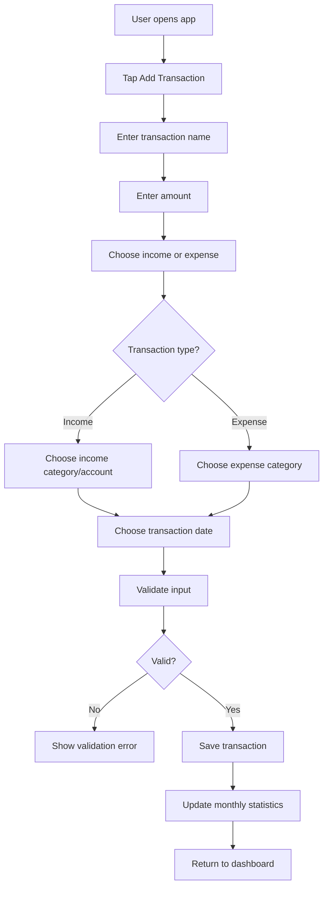
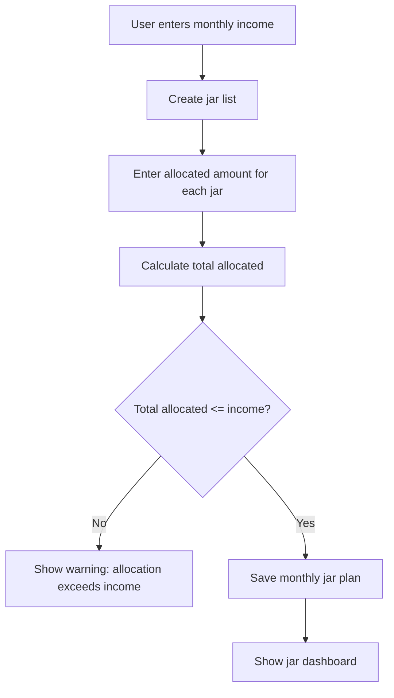
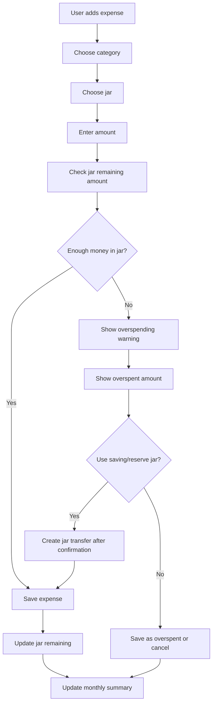

# CampusSpend – System Analysis

## 1. Overview

CampusSpend is a mobile app for personal spending control. The app helps users record income and expenses, divide income into spending jars, track whether each jar is still within budget, and warn users when spending exceeds the planned amount.

The project should start as an offline mobile app using React Native, Expo, TypeScript, and SQLite.

---

## 2. Problem Statement

Many users spend more than planned because they do not have a clear system for tracking their money. They may have monthly income and an intended spending plan, but they often do not know:

- How much they have already spent.
- Which category is consuming the most money.
- Which planned budget/jar has been exceeded.
- Whether they are still following the original plan.
- How to adjust when one category is overspent.

CampusSpend aims to solve this by combining traditional expense tracking with spending jar management.

---

## 3. Target Users

Initial target users:

- Students.
- Young adults.
- Users with simple monthly income and expenses.
- Users who want to manage money with jars/envelopes.

Future target users:

- Couples.
- Families.
- Shared households.
- Users who want AI-assisted budget planning.

---

## 4. Core Features

### 4.1 Expense and Income Tracking

The user can record normal transactions.

A transaction should include:

- Name.
- Amount.
- Type: income or expense.
- Category.
- Account/payment method.
- Transaction date.
- Optional note.

For expense transactions, examples of categories include:

- Food.
- Transportation.
- Shopping.
- Education.
- Entertainment.
- Utilities.
- Rent.
- Health.
- Other.

For income transactions, examples include:

- Salary.
- Family support.
- Scholarship.
- Freelance.
- Other.

Payment/account methods may include:

- Cash.
- Bank transfer.
- E-wallet.
- Card.

---

### 4.2 Spending Jar Management

The user can divide income into jars.

Example:

```text
Monthly income: 10,000,000 VND

Jars:
- Rent: 2,500,000
- Food: 2,000,000
- Utilities: 500,000
- Shopping: 1,000,000
- Saving: 2,000,000
- Emergency: 2,000,000
```

When the user records an expense, they may assign it to a jar. The app checks whether the jar has enough money left.

If the jar has enough money:

```text
Save transaction
Update jar remaining amount
Update monthly summary
```

If the jar does not have enough money:

```text
Warn the user
Show overspent amount
Suggest using saving/reserve jar if available
Require user confirmation before transfer
```

---

## 5. Important Concept Separation

The app must clearly separate these concepts.

### Category

Category answers:

```text
What kind of transaction is this?
```

Examples:

```text
Food
Shopping
Education
Transportation
Salary
```

### Account / Payment Method

Account answers:

```text
Where did the money come from or how was it paid?
```

Examples:

```text
Cash
Bank transfer
E-wallet
Card
```

### Jar

Jar answers:

```text
Which planned budget does this transaction affect?
```

Examples:

```text
Food jar
Rent jar
Shopping jar
Saving jar
Emergency jar
```

A transaction can have:

```text
Category: Food
Account: Cash
Jar: Food jar
```

These three concepts must not be merged into one field.

---

## 6. Main User Flows

### Flow 1: Add Normal Transaction



---

### Flow 2: Create Spending Jars



---

### Flow 3: Add Expense With Jar



---

## 7. Business Rules

### Transaction Business Rules

1. Amount must be positive.
2. Expense is not represented by negative amount.
3. Transaction type must be either `income` or `expense`.
4. Expense requires an expense category.
5. Income should have an income category or source/account.
6. Transaction date defaults to current date.
7. User can edit transaction date.
8. Transaction must not be saved if required fields are missing.
9. Monthly summary only includes transactions in the selected month.

### Jar Business Rules

1. A jar belongs to a month.
2. A jar has an allocated amount.
3. A jar tracks current/remaining amount.
4. Expense assigned to a jar reduces that jar's remaining amount.
5. If expense amount is greater than remaining jar amount, show warning.
6. If a saving/reserve jar exists, suggest covering the overspent amount from it.
7. User must confirm any jar transfer.
8. Transfer between jars should be recorded.
9. Saving/reserve jar must not be reduced automatically.

### AI Business Rules

1. AI only suggests.
2. AI must not automatically save financial data.
3. AI should ask clarifying questions before suggesting a jar allocation plan.
4. AI should receive summarized data whenever possible, not raw full database.
5. AI-generated suggestions must be shown to the user for confirmation.

---

## 8. Data Model Draft

### 8.1 transactions

Stores all income and expense transactions.

```text
id TEXT PRIMARY KEY
name TEXT NOT NULL
amount REAL NOT NULL
type TEXT NOT NULL
category_id TEXT
account_id TEXT
jar_id TEXT
transaction_date TEXT NOT NULL
note TEXT
created_at TEXT NOT NULL
updated_at TEXT NOT NULL
```

Notes:

- `type` should be `income` or `expense`.
- `amount` must always be positive.
- `jar_id` can be null for income or for expenses not assigned to a jar.
- `transaction_date` should use a consistent format such as `YYYY-MM-DD`.

---

### 8.2 categories

Stores transaction categories.

```text
id TEXT PRIMARY KEY
name TEXT NOT NULL
type TEXT NOT NULL
created_at TEXT NOT NULL
updated_at TEXT NOT NULL
```

Examples:

```text
cat_food | Food | expense
cat_salary | Salary | income
```

---

### 8.3 accounts

Stores payment methods or money accounts.

```text
id TEXT PRIMARY KEY
name TEXT NOT NULL
type TEXT NOT NULL
created_at TEXT NOT NULL
updated_at TEXT NOT NULL
```

Examples:

```text
acc_cash | Cash | cash
acc_bank | Bank Transfer | bank
acc_ewallet | E-wallet | ewallet
```

---

### 8.4 jars

Stores monthly spending jars.

```text
id TEXT PRIMARY KEY
name TEXT NOT NULL
allocated_amount REAL NOT NULL
current_amount REAL NOT NULL
month TEXT NOT NULL
is_saving_jar INTEGER NOT NULL
created_at TEXT NOT NULL
updated_at TEXT NOT NULL
```

Notes:

- `month` should use format `YYYY-MM`.
- `is_saving_jar` should be 0 or 1 in SQLite.
- `current_amount` starts equal to `allocated_amount`.

---

### 8.5 jar_transfers

Stores money movement between jars.

```text
id TEXT PRIMARY KEY
from_jar_id TEXT NOT NULL
to_jar_id TEXT NOT NULL
amount REAL NOT NULL
reason TEXT
created_at TEXT NOT NULL
```

This table is useful when the user covers overspending from a saving/reserve jar.

---

## 9. Suggested ID Strategy

Use string IDs:

```text
id TEXT PRIMARY KEY
```

Recommended because future cloud sync and multi-device support will be easier.

Possible formats:

```text
UUID
tx_<uuid>
cat_food
jar_food_2026_05
```

Avoid depending only on `INTEGER AUTOINCREMENT` if long-term cloud sync is expected.

---

## 10. Monthly Summary Logic

### Total income

```text
Filter transactions where:
type = income
transaction_date is in selected month

Sum amount
```

### Total expense

```text
Filter transactions where:
type = expense
transaction_date is in selected month

Sum amount
```

### Balance

```text
balance = totalIncome - totalExpense
```

### Spending by category

```text
Filter transactions where:
type = expense
transaction_date is in selected month

Group by category_id
Sum amount for each group
```

### Jar remaining

```text
jarRemaining = allocatedAmount - totalExpenseAssignedToJar
```

or if using `current_amount`:

```text
currentAmount = currentAmount - expenseAmount
```

The app should be consistent with one approach.

---

## 11. Recommended MVP Development Order

### Step 1: Documentation and structure

- Create docs.
- Define MVP.
- Define data entities.
- Define business rules.

### Step 2: Static UI

- Home dashboard.
- Add transaction screen.
- Transaction list screen.
- Static sample data.

### Step 3: Temporary state

- Store transactions in memory.
- Add transaction.
- List transactions.
- Calculate summary from temporary data.

### Step 4: SQLite

- Create database layer.
- Create tables.
- Insert transaction.
- Select transactions.
- Update transaction.
- Delete transaction.

### Step 5: Reports

- Monthly summary.
- Category summary.
- Filter by month.
- Filter by category.

### Step 6: Jar Management

- Create jars.
- Assign expenses to jars.
- Show jar remaining amount.
- Warn when overspending.

### Step 7: Reserve/Saving Jar Logic

- Mark a jar as saving/reserve.
- Suggest transfer when overspending.
- Confirm transfer.
- Record transfer history.

---

## 12. Future Features

### Login and shared management

Future users may manage money together, such as a couple.

Requirements:

- User accounts.
- Shared group/household.
- Group members.
- Shared transactions.
- Notification when another member adds a transaction.
- Cloud database.

Possible future tables:

```text
users
groups
group_members
notifications
```

---

### AI budget advisor

User example:

```text
I earn 10 million VND per month. How should I divide my money?
```

AI should ask follow-up questions first:

```text
Do you pay rent?
How much do you usually spend on food?
Do you have tuition or debt?
How much do you want to save?
Do you have fixed transportation costs?
```

Then AI suggests a jar allocation plan. The user must confirm before jars are created.

---

### Chart analytics

Future charts:

- Income vs expense by month.
- Spending by category.
- Jar usage percentage.
- Monthly comparison.
- 6-month, 12-month, 24-month trend.

---

### OCR receipts

The user takes a photo of a receipt. The app extracts amount, merchant, date, and suggests a transaction. User must verify before saving.

---

## 13. Current Focus

The current focus is not to build every feature.

Current focus:

```text
1. Finalize documentation.
2. Set up Expo project.
3. Build static UI.
4. Build transaction input flow.
5. Add temporary state.
6. Add SQLite CRUD.
7. Add monthly summary.
```

Jar management is the next big module after basic tracking works.
