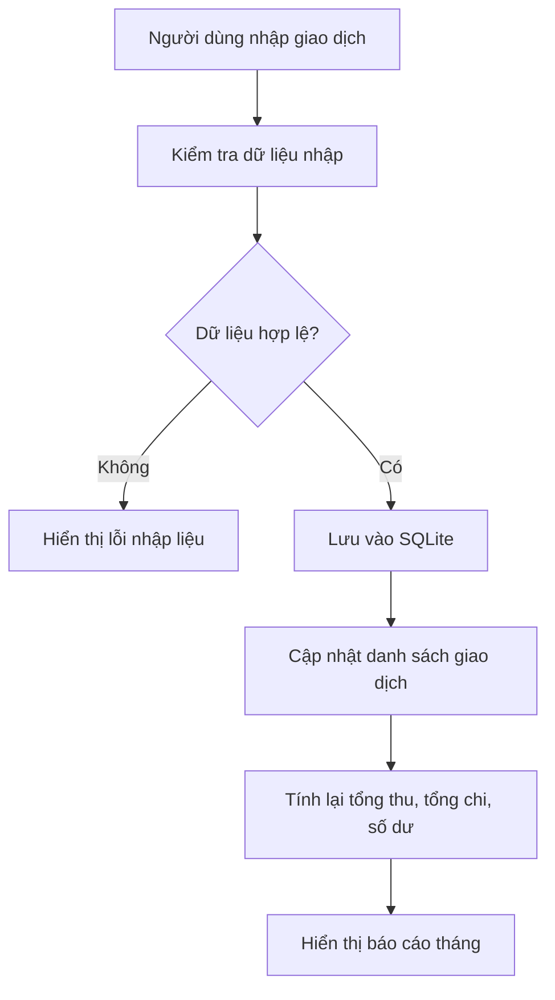
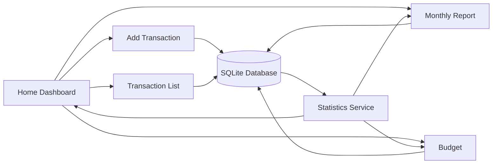

# IDEA PROJECT: Ví Sinh Viên – App Quản Lý Chi Tiêu Cá Nhân

## 1. Tóm tắt ý tưởng

**Ví Sinh Viên** là một ứng dụng quản lý thu/chi cá nhân dành cho sinh viên. App giúp người dùng ghi lại các khoản thu nhập và chi tiêu hằng ngày, xem tổng thu – tổng chi – số dư theo tháng, phân tích chi tiêu theo danh mục và cảnh báo khi gần vượt ngân sách.

Mục tiêu ban đầu không phải là tạo một app tài chính quá phức tạp, mà là xây dựng một sản phẩm nhỏ, rõ ràng, chạy được thật, có dữ liệu thật và có giá trị sử dụng thực tế.

---

## 2. Vấn đề cần giải quyết

Sinh viên thường có nhiều khoản chi nhỏ trong ngày như ăn uống, cà phê, xăng xe, học tập, giải trí, mua tài liệu. Những khoản này nhìn riêng lẻ có vẻ không đáng kể, nhưng cộng lại cuối tháng có thể rất lớn.

Vấn đề chính:

- Không biết tiền đã đi đâu.
- Không theo dõi được tổng chi theo tháng.
- Không biết danh mục nào đang tiêu nhiều nhất.
- Không có cảnh báo khi chi tiêu vượt mức dự định.
- Ghi chú chi tiêu thủ công bằng sổ hoặc note dễ bị quên và khó thống kê.

---

## 3. Đối tượng sử dụng

Người dùng chính:

- Sinh viên.
- Người mới bắt đầu tự quản lý tiền cá nhân.
- Người muốn một app đơn giản, nhập nhanh, không cần quá nhiều tính năng tài chính phức tạp.

Đặc điểm người dùng:

- Không muốn nhập liệu quá lâu.
- Muốn xem kết quả nhanh.
- Cần giao diện dễ hiểu.
- Thường quan tâm đến tiền ăn, tiền đi lại, tiền học, tiền giải trí và thu nhập từ gia đình hoặc làm thêm.

---

## 4. Giá trị cốt lõi của app

App cần trả lời được các câu hỏi quan trọng:

- Tháng này tôi đã thu bao nhiêu?
- Tháng này tôi đã chi bao nhiêu?
- Tôi còn lại bao nhiêu?
- Tôi tiêu nhiều nhất vào danh mục nào?
- Khoản chi lớn nhất gần đây là gì?
- Tôi có đang vượt ngân sách không?

Nếu app trả lời tốt những câu hỏi này, nó đã có giá trị sử dụng thực tế.

---

## 5. MVP – Phiên bản tối giản cần làm trước

MVP là bản nhỏ nhất nhưng vẫn chạy được và có ích.

### Chức năng MVP

1. Thêm giao dịch thu/chi.
2. Xem danh sách giao dịch.
3. Sửa giao dịch.
4. Xóa giao dịch.
5. Xem tổng thu, tổng chi và số dư tháng hiện tại.
6. Lọc giao dịch theo tháng.
7. Lọc giao dịch theo danh mục.

### Chưa cần làm trong MVP

- Đăng nhập.
- Cloud sync.
- AI phân tích chi tiêu.
- OCR hóa đơn.
- Xuất PDF.
- Nhiều loại tiền tệ.
- Backend riêng.
- Giao diện quá cầu kỳ.

---

## 6. Mô hình dữ liệu tổng quát

### Transaction – Giao dịch

Một giao dịch đại diện cho một khoản thu hoặc chi.

Các thông tin cần có:

- ID giao dịch.
- Số tiền.
- Loại giao dịch: thu hoặc chi.
- Danh mục.
- Ngày giao dịch.
- Ghi chú.
- Thời gian tạo.
- Thời gian cập nhật.

Ví dụ:

```text
Số tiền: 35000
Loại: Chi
Danh mục: Ăn uống
Ngày: 2026-05-24
Ghi chú: Ăn sáng
```

### Category – Danh mục

Danh mục giúp phân loại giao dịch.

Ví dụ danh mục chi:

- Ăn uống.
- Di chuyển.
- Học tập.
- Giải trí.
- Mua sắm.
- Khác.

Ví dụ danh mục thu:

- Gia đình gửi.
- Lương làm thêm.
- Học bổng.
- Khác.

### Budget – Ngân sách

Ngân sách giúp đặt giới hạn chi tiêu theo danh mục hoặc theo tháng.

Ví dụ:

```text
Danh mục: Ăn uống
Ngân sách tháng: 1.500.000đ
Đã chi: 1.200.000đ
Còn lại: 300.000đ
```

Budget chưa bắt buộc trong MVP, nhưng nên có ở phiên bản nâng cấp.

---

## 7. Tư duy tính toán trong project

Project này nên được nhìn như một hệ thống xử lý dữ liệu cá nhân.

### Input

Dữ liệu người dùng nhập:

- Khoản thu.
- Khoản chi.
- Ngày tháng.
- Danh mục.
- Ghi chú.

### Processing

App xử lý dữ liệu bằng các thao tác:

- Lọc giao dịch theo tháng.
- Lọc theo danh mục.
- Tính tổng thu.
- Tính tổng chi.
- Tính số dư.
- Gom nhóm chi tiêu theo danh mục.
- So sánh với ngân sách.

### Output

Kết quả app hiển thị:

- Danh sách giao dịch.
- Tổng thu.
- Tổng chi.
- Số dư.
- Báo cáo theo tháng.
- Biểu đồ hoặc thống kê theo danh mục.
- Cảnh báo vượt ngân sách.

---

## 8. Công thức tư duy cho các chức năng chính

### Tổng thu tháng hiện tại

```text
Lấy tất cả giao dịch
→ Lọc type = income
→ Lọc tháng hiện tại
→ Cộng amount
```

### Tổng chi tháng hiện tại

```text
Lấy tất cả giao dịch
→ Lọc type = expense
→ Lọc tháng hiện tại
→ Cộng amount
```

### Số dư

```text
Số dư = Tổng thu - Tổng chi
```

### Chi tiêu theo danh mục

```text
Lấy tất cả giao dịch chi
→ Lọc theo tháng
→ Gom nhóm theo category
→ Tính tổng từng nhóm
```

### Cảnh báo ngân sách

```text
Lấy ngân sách của danh mục
→ Tính tổng đã chi trong tháng
→ So sánh đã chi với giới hạn
→ Nếu vượt hoặc gần vượt thì cảnh báo
```

---

## 9. Kiến trúc app tổng quát

Nên chia app thành các lớp đơn giản:

```text
UI Layer
↓
State / Hook Layer
↓
Service Layer
↓
Database Layer
```

Ý nghĩa:

- **UI Layer**: Màn hình, nút bấm, ô nhập, danh sách.
- **State / Hook Layer**: Quản lý dữ liệu đang hiển thị trên màn hình.
- **Service Layer**: Xử lý logic như thêm giao dịch, tính tổng, lọc dữ liệu.
- **Database Layer**: Lưu và lấy dữ liệu từ SQLite.

Không nên để toàn bộ logic nằm trực tiếp trong giao diện.

---

## 10. Sơ đồ luồng xử lý tổng quát



---

## 11. Sơ đồ mô hình app



---

## 12. Wireframe giao diện mẫu

### Màn hình Home Dashboard

```text
┌────────────────────────────────────┐
│ Ví Sinh Viên                       │
│ Tháng 05/2026                      │
├────────────────────────────────────┤
│ Số dư hiện tại                     │
│ 1.870.000đ                         │
├────────────────────────────────────┤
│ Thu nhập        Chi tiêu           │
│ 2.000.000đ      130.000đ           │
├────────────────────────────────────┤
│ Chi tiêu theo danh mục             │
│                                    │
│ Ăn uống      ████████ 80.000đ      │
│ Di chuyển    █████    50.000đ      │
│ Học tập      ██       20.000đ      │
├────────────────────────────────────┤
│ Giao dịch gần đây                  │
│ - Ăn sáng              -35.000đ    │
│ - Cà phê               -45.000đ    │
│ - Lương part-time   +2.000.000đ    │
├────────────────────────────────────┤
│ [ + Thêm giao dịch ]               │
└────────────────────────────────────┘
```

### Màn hình thêm giao dịch

```text
┌────────────────────────────────────┐
│ Thêm giao dịch                     │
├────────────────────────────────────┤
│ Loại giao dịch                     │
│ [ Thu ] [ Chi ]                    │
│                                    │
│ Số tiền                            │
│ [ 35.000                         ] │
│                                    │
│ Danh mục                           │
│ [ Ăn uống                       v ] │
│                                    │
│ Ngày                               │
│ [ 24/05/2026                    ] │
│                                    │
│ Ghi chú                            │
│ [ Ăn sáng                       ] │
│                                    │
│ [ Lưu giao dịch ]                  │
└────────────────────────────────────┘
```

---

## 13. Timeline chi tiết

Timeline dưới đây phù hợp với người còn phải học IELTS và các môn ở trường. Mỗi ngày chỉ cần khoảng 1–2 tiếng. Nếu bận, có thể kéo dài thêm.

---

### Tuần 1 – Hiểu project và dựng nền tảng

Mục tiêu:

- Hiểu rõ app cần làm gì.
- Chốt MVP.
- Chọn công nghệ.
- Dựng project ban đầu.
- Hiểu các khái niệm căn bản của React Native.

Cần học tổng quát:

- React Native là gì.
- Expo là gì.
- Component là gì.
- State là gì.
- Props là gì.
- Cách tổ chức màn hình cơ bản.
- Cách chạy app trên điện thoại hoặc simulator.

Kết quả cần có:

- Project React Native chạy được.
- Có màn hình Home đơn giản.
- Có màn hình Add Transaction đơn giản.
- Chưa cần database, có thể dùng dữ liệu giả để test UI.

---

### Tuần 2 – Thiết kế dữ liệu và làm form nhập giao dịch

Mục tiêu:

- Thiết kế dữ liệu giao dịch.
- Làm form thêm giao dịch.
- Kiểm tra dữ liệu nhập.

Cần học tổng quát:

- Object trong JavaScript/TypeScript.
- Type cơ bản trong TypeScript.
- Form input trong React Native.
- Validation cơ bản.
- Cách lưu dữ liệu tạm bằng state.

Cần biết:

- `amount` nên lưu là số dương.
- `type` quyết định thu hay chi.
- `date` nên lưu thống nhất theo format.
- Không cho lưu giao dịch thiếu số tiền hoặc thiếu danh mục.

Kết quả cần có:

- Nhập được số tiền.
- Chọn được loại thu/chi.
- Chọn được danh mục.
- Nhập được ghi chú.
- Bấm lưu thì giao dịch xuất hiện trong danh sách tạm.

---

### Tuần 3 – Lưu trữ dữ liệu bằng SQLite

Mục tiêu:

- Dữ liệu không bị mất khi tắt app.
- Thêm, đọc, sửa, xóa giao dịch từ database.

Cần học tổng quát:

- Database là gì.
- SQLite là gì.
- Table là gì.
- Schema là gì.
- Query cơ bản.
- CRUD với SQLite.
- Khởi tạo database khi app mở.

Cần biết:

- Database là nơi lưu dữ liệu lâu dài.
- Bảng `transactions` là bảng quan trọng nhất.
- Ban đầu chỉ cần một bảng giao dịch, chưa cần quá nhiều bảng.
- Cần test kỹ việc thêm/xóa/sửa vì đây là lõi của app.

Kết quả cần có:

- Thêm giao dịch vào SQLite.
- Lấy danh sách giao dịch từ SQLite.
- Xóa giao dịch.
- Sửa giao dịch.
- Tắt app mở lại dữ liệu vẫn còn.

---

### Tuần 4 – Thống kê cơ bản

Mục tiêu:

- Biến dữ liệu giao dịch thành thông tin có ý nghĩa.

Cần học tổng quát:

- Filter dữ liệu.
- Sum dữ liệu.
- Group dữ liệu theo danh mục.
- Xử lý ngày tháng theo tháng.
- Tư duy input → processing → output.

Cần biết:

- Tính tổng thu.
- Tính tổng chi.
- Tính số dư.
- Lọc giao dịch theo tháng.
- Lọc giao dịch theo danh mục.
- Xử lý trường hợp không có dữ liệu.

Kết quả cần có:

- Home hiển thị tổng thu tháng hiện tại.
- Home hiển thị tổng chi tháng hiện tại.
- Home hiển thị số dư.
- Có thể xem giao dịch theo tháng.
- Có thể xem chi tiêu theo danh mục bằng dạng text.

---

### Tuần 5 – Hoàn thiện MVP

Mục tiêu:

- Ghép các phần thành một app dùng được.

Cần học tổng quát:

- Navigation giữa các màn hình.
- Cách refresh dữ liệu khi quay lại màn hình.
- Cách xử lý empty state.
- Cách hiện thông báo lỗi hoặc xác nhận.
- Cách tổ chức folder project gọn hơn.

Cần biết:

- Sau khi thêm giao dịch, danh sách phải cập nhật.
- Sau khi sửa/xóa, thống kê cũng phải cập nhật.
- Nếu chưa có giao dịch thì màn hình phải hiển thị thông báo dễ hiểu.
- Không nên thêm feature mới khi MVP chưa hoàn chỉnh.

Kết quả cần có:

- App có luồng sử dụng hoàn chỉnh.
- Thêm, xem, sửa, xóa hoạt động ổn.
- Tổng thu, tổng chi, số dư đúng.
- Lọc theo tháng/danh mục hoạt động ổn.
- Có thể dùng thử app trong đời sống thật.

---

### Tuần 6 – Làm đẹp vừa đủ và thêm biểu đồ đơn giản

Mục tiêu:

- App nhìn sạch hơn.
- Có báo cáo trực quan hơn.

Cần học tổng quát:

- UI/UX cơ bản.
- Card layout.
- Icon.
- Màu sắc theo trạng thái thu/chi.
- Biểu đồ đơn giản.
- Cách hiển thị dữ liệu theo dạng dễ hiểu.

Cần biết:

- Đẹp vừa đủ, không sa đà.
- Biểu đồ chỉ có ý nghĩa khi số liệu đúng.
- Ưu tiên dễ đọc hơn hiệu ứng phức tạp.

Kết quả cần có:

- Home Dashboard nhìn gọn.
- Danh sách giao dịch dễ đọc.
- Có biểu đồ hoặc thanh thống kê chi theo danh mục.
- Có giao diện nhập giao dịch rõ ràng.

---

### Tuần 7 – Ngân sách và cảnh báo

Mục tiêu:

- Tạo điểm khác biệt so với app CRUD bình thường.

Cần học tổng quát:

- Budget model.
- So sánh dữ liệu thực tế với giới hạn.
- Tính phần trăm đã dùng ngân sách.
- Hiển thị cảnh báo.

Cần biết:

- Người dùng đặt ngân sách theo danh mục hoặc theo tháng.
- App tính số tiền đã chi.
- Nếu gần vượt hoặc vượt thì cảnh báo.
- Không nên làm quá nhiều loại ngân sách ở giai đoạn đầu.

Kết quả cần có:

- Đặt ngân sách cho một danh mục.
- Xem đã dùng bao nhiêu phần trăm.
- Cảnh báo khi vượt ngân sách.
- Ví dụ: Ăn uống đã dùng 90% ngân sách tháng.

---

### Tuần 8 – Tổng kết, sửa lỗi và đóng gói project

Mục tiêu:

- Biến project thành sản phẩm có thể trình bày hoặc đưa vào CV.

Cần học tổng quát:

- Debug cơ bản.
- Test thủ công theo checklist.
- Viết README.
- Chụp ảnh demo.
- Quay video demo ngắn.
- Mô tả project theo problem → solution → features → tech stack.

Cần biết:

- README quan trọng không kém code.
- Phải có ảnh màn hình.
- Phải ghi rõ app giải quyết vấn đề gì.
- Phải ghi rõ chức năng đã làm.
- Phải ghi rõ công nghệ sử dụng.
- Không cần app hoàn hảo, nhưng cần chạy ổn.

Kết quả cần có:

- App chạy ổn.
- README hoàn chỉnh.
- Có ảnh demo.
- Có video demo ngắn nếu cần.
- Có mô tả project rõ ràng để đưa vào CV.

---

## 14. Những điều cần học theo nhóm

### Nhóm 1 – Kiến thức nền React Native

Cần biết:

- Component.
- State.
- Props.
- Hook.
- Event.
- Form input.
- List rendering.
- Navigation.

Mục tiêu học:

Không cần học React Native toàn bộ. Chỉ cần hiểu đủ để tạo màn hình, nhận input, hiển thị danh sách và chuyển màn hình.

---

### Nhóm 2 – Kiến thức TypeScript

Cần biết:

- Type cơ bản.
- Object type.
- Union type.
- Optional field.
- Function parameter type.
- Array type.

Mục tiêu học:

Dùng TypeScript để mô tả dữ liệu rõ ràng hơn, tránh nhầm lẫn giữa giao dịch thu và chi.

---

### Nhóm 3 – Kiến thức SQLite

Cần biết:

- Database.
- Table.
- Column.
- Primary key.
- Insert.
- Select.
- Update.
- Delete.
- Query lọc theo tháng.
- Query tính tổng.

Mục tiêu học:

Hiểu SQLite là nơi lưu giao dịch lâu dài. Không cần học database quá sâu ngay từ đầu.

---

### Nhóm 4 – Kiến thức xử lý dữ liệu

Cần biết:

- Filter.
- Sort.
- Sum.
- Group by.
- Date range.
- Monthly summary.
- Category summary.

Mục tiêu học:

Biết cách biến danh sách giao dịch thành báo cáo.

---

### Nhóm 5 – Kiến thức UI/UX

Cần biết:

- Màn hình nên đơn giản.
- Nút thêm giao dịch phải dễ thấy.
- Số tiền phải dễ đọc.
- Thu và chi nên phân biệt rõ.
- Empty state phải thân thiện.
- Form không nên quá dài.

Mục tiêu học:

Tạo app dễ dùng, không cần quá cầu kỳ.

---

### Nhóm 6 – Kiến thức quản lý project

Cần biết:

- Chia phase.
- Giữ scope nhỏ.
- Test từng chức năng.
- Viết README.
- Không thêm feature mới khi MVP chưa xong.
- Ghi lại lỗi và cách sửa.

Mục tiêu học:

Hoàn thành project thay vì bỏ giữa chừng.

---

## 15. Rủi ro và cách tránh

### Rủi ro 1: Học quá nhiều trước khi code

Cách tránh:

- Chỉ học thứ cần cho phase hiện tại.
- Mỗi kiến thức phải gắn với một chức năng cụ thể.

### Rủi ro 2: Copy code từ chatbot nhưng không hiểu

Cách tránh:

- Không yêu cầu chatbot viết full app.
- Chỉ hỏi ý tưởng, giải thích, skeleton, review lỗi.
- Tự viết lại phần chính bằng cách hiểu của mình.

### Rủi ro 3: Bị kẹt ở UI

Cách tránh:

- Làm UI tối giản trước.
- Ưu tiên logic đúng.
- Làm đẹp sau khi MVP chạy ổn.

### Rủi ro 4: Project bị phình to

Cách tránh:

- Khóa MVP.
- Feature nâng cao để sau.
- Mỗi tuần chỉ tập trung vào một nhóm chức năng.

### Rủi ro 5: Dữ liệu sai làm thống kê sai

Cách tránh:

- Chuẩn hóa amount, type, date.
- Test nhiều giao dịch mẫu.
- Tính thống kê dạng text trước khi làm biểu đồ.

---

## 16. Tiêu chí hoàn thành project

Project được xem là hoàn thành bản tốt nếu có:

- App chạy được trên điện thoại hoặc simulator.
- Thêm, sửa, xóa giao dịch ổn.
- Dữ liệu lưu lại sau khi tắt app.
- Tổng thu, tổng chi, số dư đúng.
- Lọc theo tháng hoặc danh mục đúng.
- Giao diện đủ sạch để demo.
- Có README mô tả rõ.
- Có ảnh hoặc video demo.
- Có thể giải thích được dữ liệu đi từ input đến output như thế nào.

---

## 17. Cách trình bày project trong CV hoặc portfolio

### Tên project

**Ví Sinh Viên – Personal Expense Tracker App**

### Mô tả ngắn

Ứng dụng quản lý thu/chi cá nhân dành cho sinh viên, hỗ trợ ghi giao dịch, phân loại chi tiêu, thống kê thu chi theo tháng và cảnh báo ngân sách.

### Tech stack

- React Native.
- Expo.
- TypeScript.
- SQLite.

### Điểm nổi bật

- Thiết kế dữ liệu giao dịch rõ ràng.
- CRUD với SQLite.
- Thống kê thu/chi theo tháng.
- Phân tích chi tiêu theo danh mục.
- Cảnh báo khi gần vượt hoặc vượt ngân sách.
- Giao diện tối giản, dễ sử dụng.

### Vai trò cá nhân

- Phân tích yêu cầu.
- Thiết kế dữ liệu.
- Xây dựng UI.
- Xử lý logic thống kê.
- Tích hợp SQLite.
- Viết README và demo.

---

## 18. Phiên bản mở rộng sau MVP

Sau khi MVP hoàn thành, có thể nâng cấp theo thứ tự:

1. Biểu đồ chi tiêu theo danh mục.
2. Ngân sách theo danh mục.
3. Cảnh báo vượt ngân sách.
4. Export CSV.
5. Tìm kiếm giao dịch.
6. Giao dịch định kỳ.
7. Backup dữ liệu.
8. AI gợi ý phân loại chi tiêu.
9. OCR hóa đơn.
10. Cloud sync.

Không nên làm các tính năng nâng cao trước khi MVP ổn định.

---

## 19. Kết luận idea

**Ví Sinh Viên** là project phù hợp để vừa học vừa làm vì nó không quá nặng như một hệ thống fullstack lớn, nhưng vẫn có đủ các phần quan trọng của một sản phẩm phần mềm thật:

- Giao diện.
- Dữ liệu.
- Database.
- CRUD.
- Thống kê.
- Trực quan hóa.
- Tư duy sản phẩm.
- Tư duy tính toán.

Mục tiêu tốt nhất là hoàn thành một bản nhỏ, chạy ổn, dữ liệu đúng và có thể demo được. Sau đó mới nâng cấp dần bằng biểu đồ, ngân sách, cảnh báo và export.

---

## 20. Project này là web hay app?

Hướng hiện tại của project là **mobile app**, không phải web truyền thống.

Công nghệ đề xuất:

```text
React Native + Expo + TypeScript + SQLite
```

Ý nghĩa:

- **React Native**: framework để xây dựng app mobile chạy trên iOS/Android.
- **Expo**: bộ công cụ giúp tạo, chạy, test và build app React Native dễ hơn.
- **TypeScript**: ngôn ngữ dùng để viết logic và giao diện app.
- **SQLite**: database local lưu dữ liệu trực tiếp trong điện thoại.

Bản đầu tiên của project sẽ là app offline/local-first:

```text
Người dùng nhập giao dịch
→ App lưu dữ liệu vào SQLite trong điện thoại
→ App đọc dữ liệu từ SQLite
→ App tính tổng thu, tổng chi, số dư
→ App hiển thị báo cáo
```

Ở giai đoạn MVP:

```text
FE / Mobile Client: React Native + TypeScript
BE: Chưa có
Database: SQLite local
```

---

## 21. Phân biệt FE, BE và Database trong project

### FE là gì?

FE là phần người dùng nhìn thấy và tương tác trực tiếp.

Trong project này, FE chính là app mobile:

```text
React Native + TypeScript
```

FE chịu trách nhiệm:

- Hiển thị màn hình.
- Nhận input từ người dùng.
- Hiển thị danh sách giao dịch.
- Hiển thị tổng thu, tổng chi, số dư.
- Hiển thị báo cáo, biểu đồ.
- Gửi yêu cầu lưu hoặc lấy dữ liệu.

### BE là gì?

BE là phần xử lý phía server, thường dùng khi app cần:

- Đăng nhập.
- Lưu dữ liệu online.
- Đồng bộ nhiều thiết bị.
- Gọi AI API an toàn.
- Quản lý người dùng.
- Bảo mật dữ liệu.

Trong MVP của project này:

```text
BE: Chưa cần
```

Vì dữ liệu chỉ lưu trong máy bằng SQLite.

### Database là gì?

Database là nơi lưu dữ liệu.

Trong MVP:

```text
Database: SQLite trong điện thoại
```

Trong bản nâng cấp có cloud:

```text
Database: PostgreSQL / MySQL / Firebase Firestore / Supabase
```

---

## 22. Các cách triển khai project theo mức độ

### Cách 1: Mobile app offline – phù hợp nhất để bắt đầu

```text
FE / Mobile Client:
- React Native
- Expo
- TypeScript

BE:
- Không có

Database:
- SQLite
```

Phù hợp cho MVP vì:

- Ít phức tạp.
- Không cần đăng nhập.
- Không cần server.
- Dễ tập trung vào logic chính.
- Dễ hoàn thành hơn khi còn phải học IELTS và môn ở trường.

Các chức năng phù hợp:

- Thêm giao dịch.
- Xem danh sách.
- Sửa/xóa giao dịch.
- Tính tổng thu.
- Tính tổng chi.
- Tính số dư.
- Lọc theo tháng.
- Lọc theo danh mục.

---

### Cách 2: Web app fullstack

Nếu chuyển sang web, công nghệ có thể là:

```text
FE:
- React hoặc Next.js
- TypeScript
- Tailwind CSS

BE:
- Node.js Express / NestJS / Spring Boot / Django / FastAPI

Database:
- PostgreSQL / MySQL / MongoDB
```

Luồng xử lý:

```text
Người dùng mở website
→ FE hiển thị giao diện
→ FE gọi API
→ BE xử lý request
→ BE lưu hoặc đọc dữ liệu từ database
→ BE trả kết quả về FE
```

Hướng này mạnh hơn về fullstack, nhưng nặng hơn vì phải học thêm:

- API.
- Server.
- Auth.
- Database online.
- Deploy.
- Bảo mật.

---

### Cách 3: Mobile app có đăng nhập và cloud

```text
FE:
- React Native
- Expo
- TypeScript

BE/Auth:
- Firebase Auth / Supabase Auth / Backend tự viết

Cloud Database:
- Firebase Firestore / Supabase PostgreSQL / PostgreSQL / MySQL
```

Phù hợp khi muốn:

- Đăng nhập tài khoản.
- Đồng bộ dữ liệu nhiều thiết bị.
- Backup dữ liệu.
- Khôi phục dữ liệu khi đổi điện thoại.

---

## 23. Hướng phát triển xa hơn sau MVP

Sau khi MVP offline chạy ổn, project có thể phát triển theo nhiều hướng.

Thứ tự khuyến nghị:

```text
1. Offline MVP
2. Báo cáo và ngân sách
3. Login và cloud backup
4. AI gợi ý danh mục
5. AI phân tích chi tiêu
6. OCR hóa đơn
```

Không nên thêm đăng nhập và AI ngay từ đầu vì sẽ khiến project bị phình to và khó hoàn thành.

---

## 24. Hướng phát triển: Đăng nhập

Đăng nhập giúp mỗi người dùng có dữ liệu riêng và có thể đồng bộ dữ liệu lên cloud.

### Mục tiêu của đăng nhập

- Mỗi user có tài khoản riêng.
- Dữ liệu không bị lẫn giữa nhiều người.
- Có thể backup dữ liệu.
- Có thể đổi máy mà không mất dữ liệu.

Ví dụ:

```text
Bảo đăng nhập
→ App lấy userId của Bảo
→ Giao dịch được lưu theo userId
→ Khi Bảo đăng nhập ở thiết bị khác, app tải lại dữ liệu của Bảo
```

### Cách 1: Firebase

```text
FE: React Native
Auth: Firebase Authentication
Cloud Database: Firestore
Local Database: SQLite nếu muốn hỗ trợ offline
```

Ưu điểm:

- Dễ bắt đầu.
- Có sẵn đăng nhập.
- Có sẵn cloud database.
- Nhanh có kết quả.

Nhược điểm:

- Ít học backend hơn.
- Phụ thuộc Firebase.
- Khó tùy chỉnh sâu hơn so với backend tự viết.

Phù hợp nếu muốn làm nhanh một app có đăng nhập và lưu cloud.

---

### Cách 2: Supabase

```text
FE: React Native
Auth: Supabase Auth
Cloud Database: Supabase PostgreSQL
```

Ưu điểm:

- Có đăng nhập.
- Có database SQL thật.
- Gần với tư duy database/backend thực tế.
- Dễ xem dữ liệu dạng bảng.

Nhược điểm:

- Cần hiểu SQL tốt hơn.
- Cần hiểu policy/quyền truy cập dữ liệu.

Phù hợp nếu muốn học database nghiêm túc hơn.

---

### Cách 3: Tự viết backend

```text
FE: React Native + TypeScript
BE: Node.js Express / NestJS / Spring Boot / FastAPI
Database: PostgreSQL / MySQL
Auth: JWT
```

Luồng xử lý:

```text
User nhập email/password
→ FE gửi request lên backend
→ Backend kiểm tra tài khoản
→ Backend trả token
→ FE lưu token
→ Request sau gửi token kèm theo
→ Backend biết user là ai
```

Ưu điểm:

- Học backend thật.
- Hiểu API, auth, token, database, security.
- CV mạnh hơn.
- Tự kiểm soát hệ thống.

Nhược điểm:

- Khó hơn nhiều.
- Tốn thời gian.
- Dễ quá tải nếu làm quá sớm.

Khuyến nghị: chỉ nên làm sau khi app offline đã ổn.

---

## 25. Hướng phát triển: Cloud sync

Khi có đăng nhập, có thể thêm đồng bộ dữ liệu.

### Cloud-only

```text
App lấy dữ liệu trực tiếp từ server/cloud
```

Ưu điểm:

- Dữ liệu luôn nằm trên cloud.
- Dễ đồng bộ.

Nhược điểm:

- Không có mạng thì trải nghiệm kém.

### Local-first

```text
App lưu trước vào SQLite
Sau đó đồng bộ lên cloud
```

Ưu điểm:

- Không có mạng vẫn dùng được.
- App phản hồi nhanh.
- Rất hợp với app ghi chi tiêu.

Nhược điểm:

- Khó hơn vì phải xử lý đồng bộ.
- Có thể gặp conflict dữ liệu nếu chỉnh sửa từ nhiều thiết bị.

Hướng tốt về lâu dài:

```text
SQLite local + cloud sync
```

Tuy nhiên, đây là tính năng sau MVP.

---

## 26. Hướng phát triển: AI

AI nên được chia thành nhiều cấp độ. Không nên nhảy ngay vào AI phức tạp.

### AI Level 1: Gợi ý danh mục giao dịch

Ví dụ người dùng nhập:

```text
trà sữa Gong Cha 45k
```

AI gợi ý:

```text
Số tiền: 45.000
Danh mục: Ăn uống
Ghi chú: trà sữa Gong Cha
```

Ví dụ khác:

```text
Grab đi học 32k
```

AI gợi ý:

```text
Số tiền: 32.000
Danh mục: Di chuyển
Ghi chú: Grab đi học
```

Đây là mức AI dễ làm nhất và hợp với app nhất.

Nguyên tắc:

```text
AI chỉ gợi ý
Người dùng phải xác nhận
App mới lưu vào database
```

---

### AI Level 2: Nhập giao dịch bằng ngôn ngữ tự nhiên

Người dùng nhập một câu:

```text
Hôm nay ăn sáng 35k, uống cà phê 45k, đổ xăng 50k
```

AI tách thành nhiều giao dịch:

```text
1. Ăn sáng | 35.000 | Ăn uống
2. Cà phê | 45.000 | Ăn uống
3. Đổ xăng | 50.000 | Di chuyển
```

Tính năng này giúp nhập giao dịch rất nhanh, nhưng cần cho người dùng kiểm tra lại trước khi lưu.

---

### AI Level 3: Phân tích thói quen chi tiêu

App tự tính dữ liệu trước, sau đó gửi bản tóm tắt cho AI.

Ví dụ dữ liệu gửi cho AI:

```text
Tháng 5:
Tổng thu: 4.000.000
Tổng chi: 3.200.000
Ăn uống: 1.500.000
Di chuyển: 400.000
Giải trí: 700.000
Học tập: 300.000
Khác: 300.000
```

AI trả về nhận xét:

```text
Tháng này bạn chi nhiều nhất cho Ăn uống.
Ăn uống và Giải trí chiếm phần lớn tổng chi tiêu.
Bạn có thể đặt ngân sách ăn uống thấp hơn cho tháng sau.
```

Lưu ý:

- AI không nên tự đọc toàn bộ database nếu không cần.
- App nên tự tính số liệu trước.
- AI chỉ dùng để viết nhận xét dễ hiểu.

---

### AI Level 4: OCR hóa đơn

Người dùng chụp hóa đơn:

```text
Ảnh hóa đơn
→ AI/OCR đọc thông tin
→ App tách số tiền, ngày, cửa hàng
→ App gợi ý giao dịch
→ Người dùng xác nhận
```

Tính năng này mạnh nhưng khó hơn vì liên quan đến:

- Camera.
- Quyền truy cập ảnh.
- OCR.
- Xử lý kết quả sai.
- Kiểm tra dữ liệu trước khi lưu.

Nên để sau cùng.

---

## 27. Vì sao nên có backend trung gian khi dùng AI?

Không nên gọi AI API trực tiếp từ app mobile nếu dùng API key riêng, vì API key có thể bị lộ.

Cách an toàn hơn:

```text
React Native App
→ Backend API của mình
→ AI Service
→ Backend kiểm tra kết quả
→ Trả kết quả về app
```

Luồng ví dụ:

```text
User nhập: "ăn sáng 35k"
→ App gửi text lên backend
→ Backend gửi text cho AI
→ AI trả về dữ liệu có cấu trúc
→ Backend kiểm tra lại
→ App hiển thị gợi ý
→ User xác nhận
→ App lưu giao dịch
```

Backend có thể dùng:

- Node.js Express.
- NestJS.
- FastAPI.
- Spring Boot.

Với giai đoạn đầu, chưa cần backend. Backend chỉ nên thêm khi có login, cloud sync hoặc AI.

---

## 28. Kiến trúc nâng cấp tổng quát

### Bản đầu tiên

```text
React Native App
    ↓
SQLite Local
```

### Bản có đăng nhập và cloud

```text
React Native App
    ↓
Auth / Backend Service
    ↓
Cloud Database
```

### Bản có AI

```text
React Native App
    ↓
Backend API
    ↓
AI Service

Backend API
    ↓
Cloud Database
```

### Bản hoàn chỉnh hơn theo hướng local-first

```text
React Native App
    ↓
SQLite Local
    ↓ sync
Backend API
    ↓
Cloud Database
    ↓
AI Service
```

---

## 29. Tech stack đầy đủ nếu phát triển lâu dài

### Mobile App

- React Native.
- Expo.
- TypeScript.

### Local Database

- SQLite.

### Authentication

Có thể chọn một:

- Firebase Auth.
- Supabase Auth.
- Backend tự viết với JWT.

### Cloud Database

Có thể chọn một:

- Firebase Firestore.
- Supabase PostgreSQL.
- PostgreSQL.
- MySQL.

### Backend trung gian

Có thể chọn một:

- Node.js Express.
- NestJS.
- FastAPI.
- Spring Boot.

### AI

Có thể chọn một:

- Gemini.
- OpenAI.
- Model AI khác.

---

## 30. Kết luận hướng phát triển

Hướng làm hợp lý nhất:

```text
Giai đoạn 1:
React Native + Expo + TypeScript + SQLite

Giai đoạn 2:
Thêm báo cáo, biểu đồ, ngân sách, cảnh báo

Giai đoạn 3:
Thêm đăng nhập và cloud backup bằng Firebase hoặc Supabase

Giai đoạn 4:
Thêm backend trung gian nếu cần AI hoặc muốn tự kiểm soát server

Giai đoạn 5:
Thêm AI gợi ý danh mục, nhập giao dịch bằng ngôn ngữ tự nhiên, phân tích chi tiêu

Giai đoạn 6:
Thêm OCR hóa đơn nếu muốn nâng cấp mạnh hơn
```

Không nên làm tất cả ngay từ đầu. Mục tiêu quan trọng nhất vẫn là hoàn thành bản offline chạy ổn trước.
